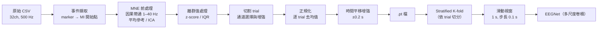

# Offline Motor Imagery EEG Analysis Pipeline（EEG_MIEXP）

> 大學專題第一階段（個人開發），指導教授：魏群樹（陽明交大資工）
> 本 repo 為公開整理版：受試者已匿名為 S01–S07，**不包含任何原始腦波資料**

針對實驗室的運動想像（Motor Imagery, MI）實驗資料，建立一套**以 JSON 設定檔驅動的離線 EEG 分析流程**：從原始 CSV 到前處理、trial 切割、特徵擷取、傳統機器學習與 EEGNet 分類、消融實驗；最後再把離線流程改成與即時 BCI 系統一致，讓離線訓練的模型能直接部署到線上。

## 重點摘要

| | |
|---|---|
| **資料** | 7 位受試者，32 通道 EEG、500 Hz；四類運動想像：左手、右手、雙腳、舌頭 |
| **流程** | 因果帶通濾波 → 平均參考 → 離群值處理 → trial 切割 → 通道選擇與增強 → 正規化 → EEGNet／LDA 分類 |
| **評估** | 依 trial 做 Stratified K-fold，**切分後才做滑動視窗**，避免同一 trial 的視窗同時出現在訓練與驗證集；並修正了一個正規化造成的資料洩漏 |
| **結果** | 同一 session 內平均準確率 **77–98%**（7 位受試者）；**換到另一次錄製的資料，6 位受試者降到 21–39%**，接近隨機（25%） |
| **意義** | 顯示腦波在不同 session 間的**分布漂移**是 BCI 實用化的關鍵障礙；據此把離線流程改為與即時系統一致（因果濾波、逐 trial 去均值、時間平移增強） |

## 1. 實驗設計

每個 trial 的時序（marker 定義見 [`global_json/background.json`](global_json/background.json)）：

| 時間（秒） | 0 – 2 | 2 – 3 | 3 – 6 | 6 – 7.5 |
|---|---|---|---|---|
| 畫面 | 注視十字（開始時有提示音） | 方向提示（Cue） | **運動想像** | 休息 |

- Marker `6`–`9` 分別對應左手、右手、雙腳、舌頭；實驗中另有睜眼／閉眼、PVT（注意力測驗）等段落
- 每位受試者有運動想像（MI）與實際動作（ME）兩種 run
- 分析時以 Cue 後 1 秒（運動想像開始）為 0 點切割 trial

## 2. 處理流程



| 步驟 | 做法 | 程式 |
|---|---|---|
| 設定檔驅動 | 通道、marker、每個前處理步驟的開關、模型超參數全部由 JSON 控制；每次實驗自動把設定與結果一起記錄 | [`pipeline/data_process/json/setting.json`](pipeline/data_process/json/setting.json)、[`pipeline/DL/json/`](pipeline/DL/json/) |
| 前處理 | MNE 帶通濾波（1–40 Hz，`phase='minimum'` 因果濾波）、平均參考、可選 ICA 與壞通道偵測 | [`utils/preprocess.py`](pipeline/data_process/utils/preprocess.py) |
| 離群值 | z-score 或 IQR 偵測，以相鄰值、中位數或平均值取代 | [`utils/process_outlier.py`](pipeline/data_process/utils/process_outlier.py) |
| 通道 | 可選 9／11／13 個運動皮質附近通道；通道增強：C3+C4、C3−C4、C4−C3、Cz×2 | [`global_json/background.json`](global_json/background.json)、[`data_processor.py`](pipeline/data_process/data_processor.py) |
| 模型 | 修改版 EEGNet：多個大小不同的時間卷積核並行（32–512），再接多尺度空間卷積與 separable conv；訓練時加入高斯雜訊與通道隨機丟棄 | [`model_architecture/EEGNet.py`](pipeline/DL/model_architecture/EEGNet.py) |
| 傳統特徵 | CSP、黎曼幾何（切空間）、Hjorth、差分熵、PSD，搭配 LDA／SVM（第一版流程） | [`legacy/src/embedding.py`](legacy/src/embedding.py) |

## 3. 離線與即時系統的對齊（v2）

要讓離線訓練的模型直接部署到即時系統，兩邊的資料處理方式必須一致，否則模型在線上看到的資料分布會和訓練時不同。v2 流程做了三項修改：

| 問題 | 修改 |
|---|---|
| 離線濾波（零相位）會用到「未來」的資料，即時系統做不到 | 改為**因果濾波**（`phase='minimum'`），只使用過去的資料 |
| 離線用整份資料的平均與標準差做 Z-score，即時系統拿不到整份資料 | 改為**每個 trial 各自去均值**，與即時端對每個視窗去均值的做法一致 |
| 即時系統的滑動視窗起點不固定，和離線切 trial 的位置有偏差 | 加入 **±0.2 秒時間平移增強**，每個 trial 產生多個偏移版本 |

輸出的 `.pt` 在 metadata 中記錄 `normalization_method`、`time_jitter`、`causal_filter`，供下游系統檢查。

## 4. 結果

詳細表格與說明見 [`results/`](results/README.md)。

**同一 session 內 vs 另一次錄製的資料（EEGNet，4 類，隨機為 25%）**

| 受試者 | S01 | S02 | S03 | S04 | S05 | S06 | S07 |
|---|---|---|---|---|---|---|---|
| 同 session（6-fold 平均） | 95.4% | 76.9% | 84.7% | 86.7% | 93.4% | 84.8% | 98.3% |
| 跨 session（3 次測試） | 27–89% | 27–30% | 27–36% | 30–36% | 25–39% | 22–25% | 21–24% |

- 同 session 的高準確率不是資料洩漏造成的：切分是依 trial 進行，切分後才做滑動視窗
- 跨 session 時，除了 S01 之外都接近隨機；S01 在不同測試之間差異很大（27–92%），測試設定仍待確認
- 在多位受試者合併的資料上，前處理全開時 **LDA（CSP＋黎曼幾何等特徵）為 80.9%，EEGNet 為 87.5%**

## 5. 程式結構

```
EEG_MIEXP_Public_ver/
├── README.md
├── requirements.txt
├── global_json/
│   └── background.json          ← 32 通道定義、通道組合、事件 marker（不需修改）
├── pipeline/                    ← v2 流程（與即時系統對齊）
│   ├── data_process/            ← 原始 CSV → .pt
│   ├── DL/                      ← .pt → EEGNet 訓練與測試
│   └── label_encoder/
├── legacy/                      ← v1 一體式流程：傳統特徵、LDA／SVM、消融實驗（參考用）
└── results/                     ← 匿名化的實驗結果彙整
```

## 6. 使用方式

```bash
pip install -r requirements.txt

# 1. 原始 CSV → .pt（設定見 pipeline/data_process/json/setting.json）
cd pipeline/data_process
python data_processor.py --verify

# 2. 訓練 EEGNet
cd ../DL
python train.py --pt_path ../data_process/output/S01_processed.pt

# 3. 用另一份資料測試
python test.py --pt_path path/to/another_session.pt
```

各步驟的詳細說明見 [`pipeline/data_process/README.md`](pipeline/data_process/README.md) 與 [`pipeline/DL/README.md`](pipeline/DL/README.md)。原始 CSV 為 Cygnus 裝置匯出格式，需放在 `pipeline/data_process/ori_csv_data/<受試者>/` 下。

## 7. 與後續專題的關係

這個 repo 產出的 `.pt` 資料與 EEGNet 模型，是專題第二階段「即時腦波控制節奏遊戲＋強化學習閉環校正」系統的初始模型與預訓練資料；`.pt` 格式與該系統相容。

## 致謝

- 指導教授：魏群樹（陽明交大資工）
- 感謝參與實驗的受試者；為保護個人資料，本 repo 不包含任何原始腦波，受試者一律以 S01–S07 表示
